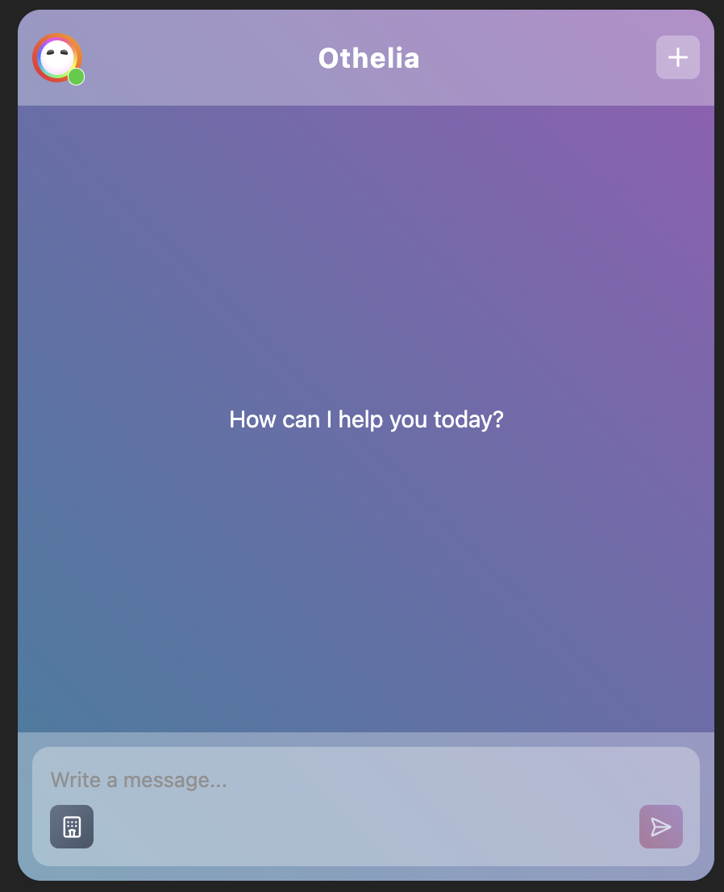

# Otelier Chat UI

A modern React-based chat interface for Otelier, designed to provide seamless communication and hotel selection features. This project leverages TypeScript, modular components, and a clean UI for an optimal user experience.



## Features

- **Real-time Chat**: Interactive chat interface with support for streaming messages.
- **Hotel Selector**: Easily select hotels from a curated list.
- **Context Providers**: Robust state management using React Context for app, chat, error, and hotel states.
- **Custom Components**: Includes reusable UI elements like buttons, tooltips, toggles, and error displays.
- **Mermaid Diagrams**: Visualize flows and data using Mermaid.js integration.
- **Audio & Visual Assets**: SVG icons and notification sounds for enhanced UX.
- **TypeScript Support**: Strong typing for reliability and maintainability.

## Project Structure

```
src/
	api/           # API calls for hotels, threads, and streaming
	assets/        # SVGs and audio files
	components/    # Modular React components
	context/       # React Context providers and hooks
	lib/           # Utility functions
	types/         # TypeScript type definitions
stories/         # Storybook stories for components
```

## Getting Started

### Prerequisites

- Node.js (v18+ recommended)
- npm or yarn

### Installation

```bash
npm install
```

### Running the App

```bash
npm start
```

### Storybook

```bash
npm run storybook
```

## Scripts

- `npm start` — Run the development server
- `npm run build` — Build for production
- `npm run storybook` — Launch Storybook for component development

## License

MIT
